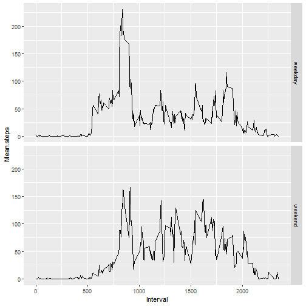

Load and preprocessing the data


```r
setwd("C:/Users/Jack Kerguenel/Documents/Data science/Rep Research/Courseproject1")
## Read the data
rawData<-read.csv("activity.csv")
## Change the Date column from character type to date type
rawData$date<-as.Date(rawData$date, format="%Y-%m-%d")
```

Total number of steps taken per day


```r
## Total number of steps taken per day
totalStepsPerDay<-aggregate(rawData$steps,by=list(Group.date=rawData$date),sum)
names(totalStepsPerDay)<-c("Group.date","Total.steps")
```

Histogram of total numbers of steps per day


```r
## Parameters og graph
par(las=2,cex=0.5)
## Histogram
barplot(totalStepsPerDay$Total.steps,names.arg=totalStepsPerDay$Group.date)
```


Calculation of the mean and median of the total number of steps taken each day


```r
meanStepsPerDay<-mean(totalStepsPerDay$Total.steps,na.rm=TRUE)
medianStepsPerDay<-median(totalStepsPerDay$Total.steps,na.rm=TRUE)
```

The mean of the total number of steps taken each day is 1.0766189 &times; 10<sup>4</sup> and the median is 10765

Time series plot for mean steps per interval throughout all days


```r
meanStepsPerInterval<-aggregate(rawData$steps,by=list(Group.interval=rawData$interval),function(x) mean(x,na.rm=TRUE))
names(meanStepsPerInterval)<-c("Group.interval","Mean.steps")
plot(meanStepsPerInterval$Group.interval,meanStepsPerInterval$Mean.steps,type = "l",xlab="Interval",ylab="Mean steps")
```


Which 5-minute interval, on average across all the days in the dataset, contains the maximum number of steps?


```r
maxIndex<-which.max(meanStepsPerInterval$Mean.steps)
maxInterval<-meanStepsPerInterval$Group.interval[maxIndex]
```
The 5-minute interval that on average contains the maximum number of steps is 835

Number of NAs in the raw data


```r
logicVector<-is.na(rawData$steps)
NANumber<-sum(logicVector)
NANumberPercent<-mean(logicVector)*100
```
The number of NAs in the steps column of the raw data is 2304

Imputing steps with NAs in raw data with the mean of the steps throughout all days in the corresponding interval

```r
rawDataExtended<-data.frame(rawData, is.na=logicVector)
for (i in 1:17568) {
        if (rawDataExtended$is.na[i]==TRUE) {
                interval<-rawDataExtended$interval[i]
                index<-which(meanStepsPerInterval$Group.interval==interval)
                rawDataExtended$steps[i]<-meanStepsPerInterval$Mean.steps[index]
        }
}
```

Total number of steps taken per day with the imputed dataset


```r
## Total number of steps taken per day
totalStepsPerDayImputed<-aggregate(rawDataExtended$steps,by=list(Group.date=rawDataExtended$date),sum)
names(totalStepsPerDayImputed)<-c("Group.date","Total.steps")
```

Histogram of total numbers of steps per day with the imputed dataset


```r
## Parameters og graph
par(las=2,cex=0.5)
## Histogram
barplot(totalStepsPerDayImputed$Total.steps,names.arg=totalStepsPerDayImputed$Group.date)
```


Calculation of the mean and median of the total number of steps taken each day with the imputed dataset


```r
meanStepsPerDayImputed<-mean(totalStepsPerDayImputed$Total.steps,na.rm=TRUE)
medianStepsPerDayImputed<-median(totalStepsPerDayImputed$Total.steps,na.rm=TRUE)
```

The mean of the total number of steps taken each day with the imputed dataset is 1.0766189 &times; 10<sup>4</sup> and the median is 1.0766189 &times; 10<sup>4</sup>; as it can be seen the mean does not change from the raw dataset with NAs to the imputed dataset, and the median changes just a bit, mainly because the imputed values are calculated from the 5-minutes intervals means of the rest of the data, which overall makes it more or less the same for summary statistics purposes. 

Create a new factor variable in the dataset with two levels – “weekday” and “weekend” indicating whether a given date is a weekday or weekend day


```r
## Adding the name of the day
rawDataExtended1<-data.frame(rawDataExtended,weekday=weekdays(rawDataExtended$date),weekdayOrWeekendCharacter=c("weekday"))
## Find out if a day is weekday or weekend and add that as a column of factors
for (i in 1:nrow(rawDataExtended1)) {
        if (rawDataExtended1$weekday[i]=="sábado" | rawDataExtended1$weekday[i]=="domingo") {
        rawDataExtended1$weekdayOrWeekendCharacter[i]<-c("weekend")
        }
}
rawDataExtended1<-data.frame(rawDataExtended1,weekdayOrWeekendFactor=as.factor(rawDataExtended1$weekdayOrWeekendCharacter))
## Eliminate columns that are not useful anymore
rawDataExtended1$is.na=NULL
rawDataExtended1$weekdayOrWeekendCharacter=NULL
```

Panel plot time series plot for mean steps per interval for weekends and for weekdays 


```r
## Subset of weekdays and weekends
weekdaysSubset<-subset(rawDataExtended1,rawDataExtended1$weekdayOrWeekendFactor=="weekday")
weekendSubset<-subset(rawDataExtended1,rawDataExtended1$weekdayOrWeekendFactor=="weekend")
## Average steps for intervals on weekdays
meanStepsPerIntervalWeekdays<-aggregate(weekdaysSubset$steps,by=list(Group.interval=weekdaysSubset$interval),function(x) mean(x,na.rm=TRUE))
names(meanStepsPerIntervalWeekdays)<-c("Interval","Mean steps")
meanStepsPerIntervalWeekdays<-data.frame(meanStepsPerIntervalWeekdays,Weekday.or.weekend=as.factor("weekday"))
## Average steps for intervals on weekends
meanStepsPerIntervalWeekends<-aggregate(weekendSubset$steps,by=list(Group.interval=weekendSubset$interval),function(x) mean(x,na.rm=TRUE))
names(meanStepsPerIntervalWeekends)<-c("Interval","Mean steps")
meanStepsPerIntervalWeekends<-data.frame(meanStepsPerIntervalWeekends,Weekday.or.weekend=as.factor("weekend"))
## Append Mean Steps Per Intervals data frames
mergedDataFrames<-rbind(meanStepsPerIntervalWeekdays,meanStepsPerIntervalWeekends)
names(mergedDataFrames)<-c("Interval","Mean.steps","Weekday.or.weekend")
## Panel plots
library(ggplot2)
graph<-ggplot(mergedDataFrames,aes(x=Interval,y=Mean.steps))
graph<-graph + geom_line() + facet_grid(Weekday.or.weekend ~ .)
graph
```


